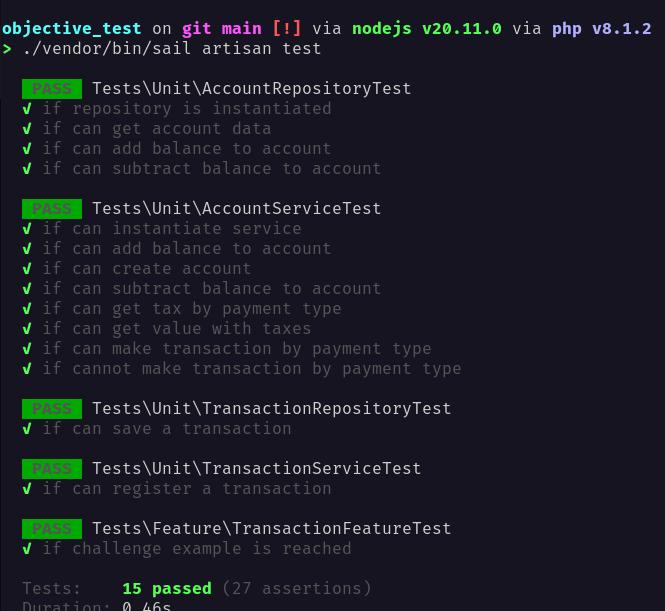
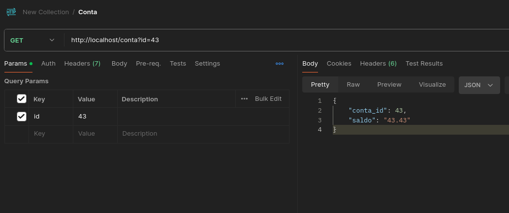
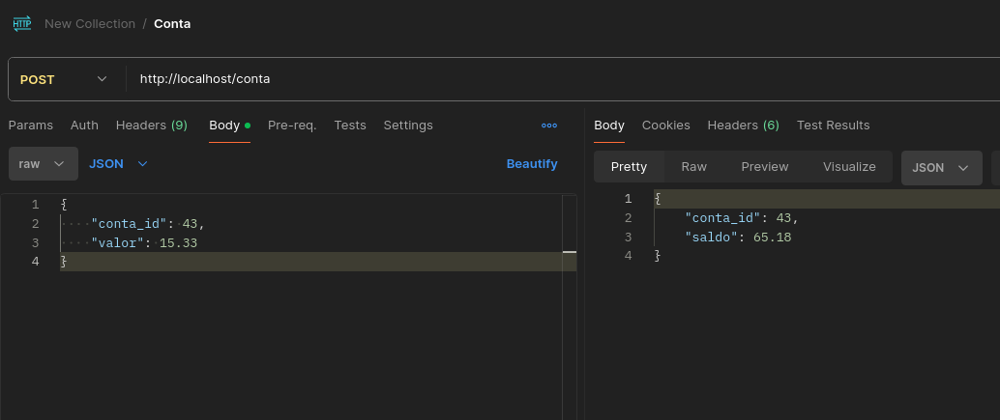
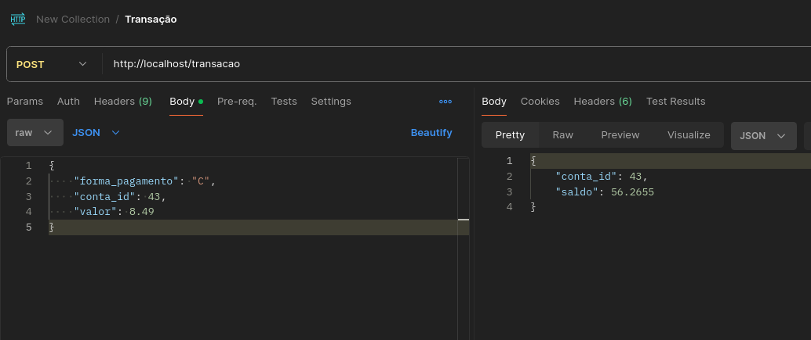

# Desafio Técnico Objective

## Criar um sistema de gestão bancária via API

### Como executar o projeto

1. Após clonar o projeto, deve-se acessar a pasta do mesmo e executar o comando abaixo
2. ```docker run --rm -u "$(id -u):$(id -g)" -v "$(pwd):/var/www/html" -w /var/www/html laravelsail/php83-composer:latest composer install --ignore-platform-reqs```
   1. O comando criar um container, que irá instalar a pasta ```vendor``` no projeto, permitindo utilizar o laravel sail
3. Após finalizar a instalação, deve-se fazer copiar o arquivo ```.env.example``` , e renomear para ```.env```, e atualizar os valores preenchidos no arquivo, como usuário e senha do banco de dados
   1. Caso queira executar os testes, deve fazer uma copia adicional do arquivo ```.env.example```, e renomear para ```.env.testing```, alterando os valores do banco de dados, e a base para ```testing```
4. Após fazer a configuração do arquivo ```.env```, deve-se executar o comando ```./vendor/bin/sail up -d```, e aguardar o docker subir os containers responsáveis pela aplicação e banco de dados
5. Ao finalizar, deve-se executar os seguintes comandos
   1. ```./vendor/bin/sail artisan migrate:fresh```
   2. Caso seja necessário executar os testes, executar também o seguinte comando
      1. ```./vendor/bin/sail artisan migrate:fresh --env=testing```
6. A API já está pronta para ser executada, nos endpoints a seguir
   1. GET /conta
   2. POST /conta
   3. POST /transacao
7. Caso queira executar os testes, pode-se executar o seguinte comando
   1. ```./vendor/bin/sail artisan test```
   2. Os testes utilizam o arquivo ```.env.testing```, ou o arquivo ```phpunit.xml``` para capturar as variáveis de ambiente
   3. Foi criada somente uma implementação do repositório, usando o Eloquent, para fazer a persistência dos dados

### Exemplo da execução dos testes



### Exemplo das requisições

1. 
2. 
3. 
